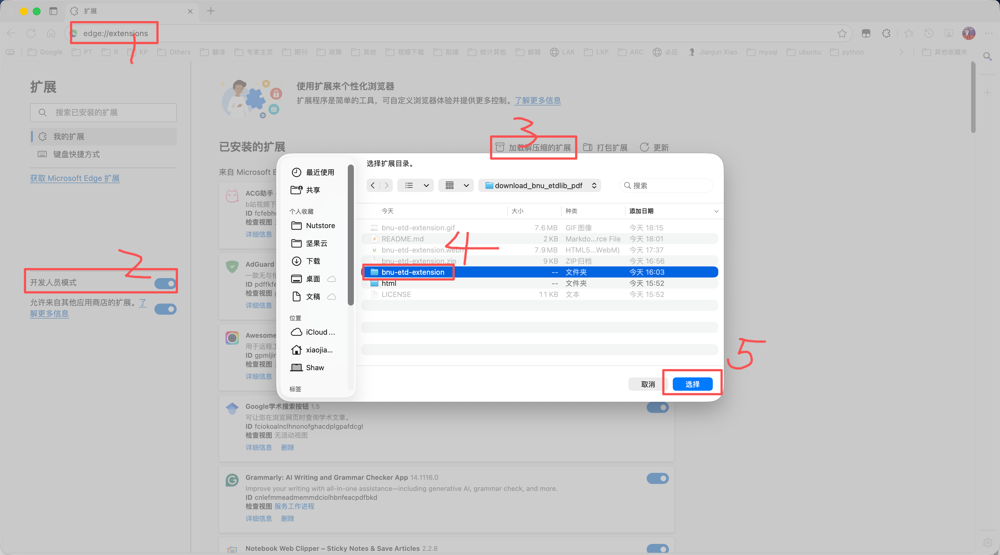

🐦‍⬛小鸦PDF——北师大学位论文阅读器插件
===============================================

.. image:: https://img.shields.io/github/license/etShaw-zh/download_bnu_etdlib_pdf?color=2E75B6
   :alt: License
.. image:: https://img.shields.io/github/downloads/etShaw-zh/download_bnu_etdlib_pdf/total?logo=github&color=2E75B6
   :alt: Downloads

简介
-----------------------------------------------
小鸦PDF 是一个完全基于原生 JavaScript 编写的浏览器扩展，用于在北京师范大学学位论文阅读器（`etdlib.bnu.edu.cn <https://etdlib.bnu.edu.cn>`_）中自动滚动、触发所有懒加载页面，并在一次流程里将整本论文无损导出为 PDF。插件不依赖后端服务，完成后浏览器会直接弹出保存对话框。

.. image:: _static/bnu-etd-extension.gif
   :alt: 小鸦PDF 导出演示

下载方式
-----------------------------------------------
- **Release 包（推荐）**：访问 `GitHub Releases <https://github.com/etShaw-zh/download_bnu_etdlib_pdf/releases>`_ 下载最新的 ``bnu-etd-extension.zip``，解压即可得到可直接加载的 ``bnu-etd-extension/`` 目录。
- **源码方式**：克隆仓库，直接使用 ``bnu-etd-extension/`` 目录进行开发或调试。

使用步骤
-----------------------------------------------
1. 打开 Chrome 的 ``chrome://extensions``（Edge 为 ``edge://extensions``），并启用“开发者模式”。
2. 点击“加载已解压的扩展程序”，选择 Release 解压后的 ``bnu-etd-extension/``（或源码中的 ``bnu-etd-extension/``）目录。
3. 打开学位论文阅读页，点击浏览器工具栏中的插件图标，再选择“开始加载并导出”。
4. 在滚动加载过程中保持目标标签页处于激活状态，直至浏览器弹出保存窗口并保存 PDF。

版权提示与免责声明
-----------------------------------------------
- 本项目仅供个人学习与科研参考，严禁对外传播、分享或商业使用。
- 被导出的论文内容归北京师范大学及原作者所有，请在尊重版权的前提下使用。
- 建议阅读完成后立即删除导出的 PDF，若因违规使用造成风险，责任由使用者自行承担。
